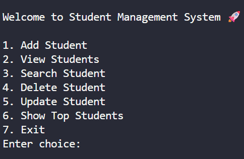
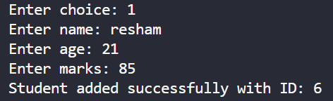
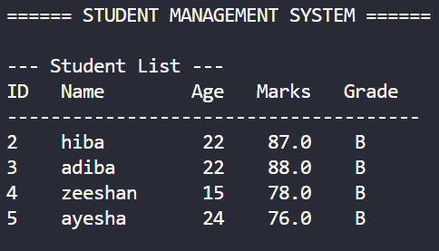
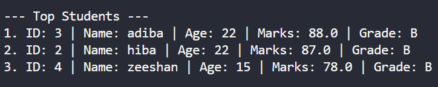
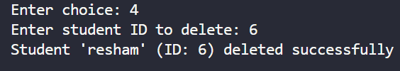
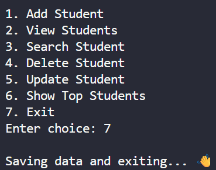

# Student Management System
# minor python project
A command-line based Student Management System built using Python. This project allows users to manage student records with features like adding, viewing, searching, updating, deleting, ranking, and grading students. Data is stored permanently using a JSON file.

## Features

* Add student records
* View all students in formatted table output
* Search students using unique ID
* Update student information
* Delete student records
* Automatic unique ID generation
* Top 3 student ranking system
* Grade calculation system (A/B/C/D)
* Input validation for age and marks
* JSON-based permanent storage
* Safe file handling with error handling
* Professional CLI interface

## Technologies Used

* Python 3
* JSON

## Project Structure

## Structure
Student-Management-System/
│
├── main.py
├── operations.py
├── file_handler.py
├── students.json
├── README.md
│
└── screenshots/
    ├── add_students.png
    ├── delete_students.png
    ├── exit_message.png
    ├── student_table.png
    ├── top_students.png
    └── welcome.png

## How to Run the Project

1. Clone the repository:

```bash
git clone https://github.com/Nayab-Fatima17/Student-Management-System.git
```

2. Navigate to the project folder:

```bash
cd Student-Management-System
```

3. Run the project:

```bash
python main.py
```

## Sample Menu Output

```text
Welcome to Student Management System 🚀

1. Add Student
2. View Students
3. Search Student
4. Delete Student
5. Update Student
6. Show Top Students
7. Exit
```

## Sample Student Table

```text
ID   Name        Age   Marks   Grade
--------------------------------------
1    hiba        22    87.0    B
2    zee         16    90.0    A
```

## Learning Outcomes

This project helped in understanding:

* Python functions
* Lists and dictionaries
* File handling
* JSON storage
* Input validation
* Modular programming
* CLI application structure
* Git and GitHub workflow

## Project Screenshots

### Welcome Screen

Displays the main menu interface of the Student Management System.



---

### Add Student

Shows adding a new student with automatic unique ID generation.



---

### Student Table Output

Displays all students in formatted tabular structure with grades.



---

### Top Students Ranking

Shows the top 3 students ranked according to marks along with grades.



---

### Delete Student Operation

Demonstrates successful deletion of a student using unique ID.



---

### Exit Message

Displays safe program termination with a user-friendly exit message.



